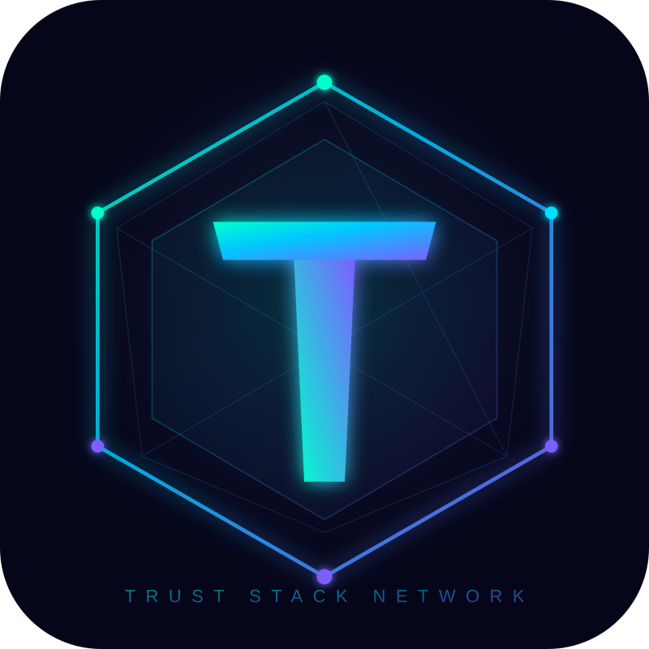
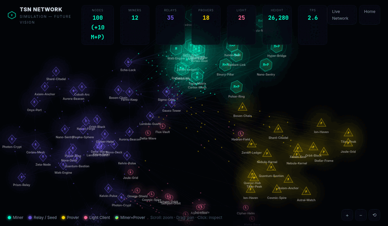

<p align="center">
  
</p>

<h1 align="center">Trust Stack Network (TSN)</h1>

<p align="center">
  <strong>Post-quantum privacy blockchain</strong><br>
  Plonky3 STARKs &bull; ML-DSA-65 &bull; Poseidon2 &bull; Shielded Transactions
</p>

<p align="center">
  
  
  
  
  
</p>

<p align="center">
  <a href="https://tsnchain.com">Website</a> &bull;
  <a href="https://tsnchain.com/whitepaper.html">Whitepaper</a> &bull;
  <a href="https://tsnchain.com/tsn-whitepaper-v0.4.pdf">Whitepaper PDF</a> &bull;
  <a href="https://tsnchain.com/docs.html">Docs</a> &bull;
  <a href="https://tsnchain.com/blog.html">Blog</a> &bull;
  <a href="https://explorer.tsnchain.com">Explorer</a> &bull;
  <a href="https://tsnchain.com/network-simulation.html">Network Simulation</a>
</p>

---

## What is TSN?

Trust Stack Network is a **Layer 1 blockchain** designed from the ground up for **privacy** and **post-quantum security**. Every transaction is shielded by default using zero-knowledge proofs, and all cryptographic primitives are quantum-resistant — protecting funds against both classical and future quantum adversaries.

## Key Features

| Feature | Description |
|---------|-------------|
| **Plonky3 STARKs** | Next-gen AIR-based zero-knowledge proofs — no trusted setup, truly post-quantum |
| **ML-DSA-65 (FIPS 204)** | NIST post-quantum digital signatures for all transactions and blocks |
| **SLH-DSA (FIPS 205)** | Stateless hash-based signatures as secondary post-quantum layer |
| **Poseidon2** | ZK-friendly hash function over the Goldilocks field, 3x faster than Poseidon |
| **Shielded Transactions** | Amounts and addresses hidden by default via ZK commitments and nullifiers |
| **UTXO Model** | Bitcoin-inspired unspent transaction outputs with privacy |
| **MIK Consensus** | Mining Identity Key — Proof of Work with anti-Sybil protection |
| **Kademlia DHT** | Decentralized peer discovery with gossip-based block propagation |

## Security Model

TSN is designed to be **fully quantum-safe** — not just signatures, but the entire transaction privacy stack:

| Attack Vector | Protection |
|---------------|------------|
| Forge signatures | ML-DSA-65 (NIST PQ standard) |
| Break ZK proofs | Plonky3 STARKs (hash-based, no elliptic curves) |
| Crack commitments | Poseidon over Goldilocks field |
| Brute force hashes | Poseidon2 (256-bit security) |
| Sybil mining | MIK identity bound to blockchain |

### Mining Identity Key (MIK)

Every miner must register a **Mining Identity Key** before mining:

- Derived from their ML-DSA-65 public key: `MIK_ID = SHA-256("TSN_MIK_ID_v1" || pubkey || block_height)`
- One active MIK per public key — prevents Sybil attacks
- Lifecycle: registration → activation delay (10 blocks) → active → optional expiry/revocation
- Block signatures verified against the miner's registered MIK

## Architecture

```
┌──────────────────────────────────────────────────────────────────────┐
│                           TSN Node v0.4.0                            │
├──────────────┬──────────────┬──────────────┬─────────────────────────┤
│    Core      │    Crypto    │  Consensus   │        Network          │
│  Block       │  Poseidon2   │  PoW Mining  │  P2P Protocol           │
│  Transaction │  ML-DSA-65   │  MIK Anti-   │  Kademlia DHT           │
│  UTXO State  │  Plonky3 ZK  │    Sybil     │  Gossip & Sync          │
│  Validation  │  SLH-DSA     │  Difficulty   │  Rate Limiting          │
│              │  Nullifiers  │    Adjust    │  Anti-Eclipse            │
├──────────────┴──────────────┴──────────────┴─────────────────────────┤
│  Storage (SledDB)  │  Wallet (Shielded ZK)  │  RPC (REST + JSON-RPC) │
├────────────────────┼────────────────────────┼────────────────────────┤
│  Explorer          │  Faucet (Testnet)      │  Metrics & Health      │
└────────────────────┴────────────────────────┴────────────────────────┘
```

### Cryptography Stack

| Layer | Primitive | Standard | Purpose |
|-------|-----------|----------|---------|
| Signatures | ML-DSA-65 | FIPS 204 | Transaction & block signing |
| Backup Signatures | SLH-DSA (SPHINCS+) | FIPS 205 | Stateless hash-based fallback |
| ZK Proofs | Plonky3 STARKs (AIR) | — | Shielded transaction validity |
| Hash Function | Poseidon2 | — | PoW mining, Merkle trees, commitments |
| Field | Goldilocks | p = 2⁶⁴ - 2³² + 1 | ZK-friendly arithmetic |
| Encryption | ChaCha20-Poly1305 | RFC 8439 | Note payload encryption |

### Signature Sizes

| Parameter | ML-DSA-65 |
|-----------|-----------|
| Public Key | 1,952 bytes |
| Secret Key | 4,032 bytes |
| Signature | 3,309 bytes |

### Commitment Scheme

```
Note Commitment = Poseidon(domain=1, value, pk_hash, randomness)
Nullifier       = Poseidon(domain=3, nullifier_key, commitment, position)
Merkle Node     = Poseidon(domain=5, left, right)
```

## Node Types

| Type | Role | Reward |
|------|------|--------|
| **Miner** | Produces blocks, earns block reward | 85% of block reward |
| **Relay/Seed** | Stores chain, relays blocks & transactions | 8% relay pool |
| **Prover** | Generates ZK proofs on demand | Proving fees |
| **Light Client** | Wallet-only, verifies via proofs | — |

## Network

| Parameter | Value |
|-----------|-------|
| Default Port | 8333 |
| Block Reward | 50 TSN |
| Target Block Time | 10 seconds |
| Difficulty Adjustment | Every 10 blocks |
| Coin Decimals | 9 (1 TSN = 10⁹ base units) |
| Max Spends per Tx | 10 |
| Max Outputs per Tx | 4 |
| Peer Discovery | Kademlia DHT |
| Block Propagation | Gossip protocol |

### Testnet

The private testnet is live with **5 nodes** across Europe:

| Node | Address |
|------|---------|
| seed-1 | `seed1.tsnchain.com:9333` |
| seed-2 | `seed2.tsnchain.com:9333` |
| seed-3 | `seed3.tsnchain.com:9333` |
| seed-4 | `seed4.tsnchain.com:9333` |

### Synchronization & Anti-Fork

TSN v0.4.0 introduces a **fast-sync protocol** allowing new nodes to join the network in minutes:

1. New node downloads a **gzip-compressed state snapshot** from any peer (`/snapshot/download`)
2. Loads the V2 Merkle tree directly into memory — no full chain replay needed
3. Syncs only the missing blocks since the snapshot height
4. Ready to mine in **under 5 minutes** (vs. 2+ hours full replay)

**Anti-fork protections:**

| Protection | Description |
|------------|-------------|
| **Heaviest chain rule** | Fork choice based on cumulative proof-of-work (sum of difficulties), not longest chain |
| **MAX_REORG_DEPTH = 100** | No reorg deeper than 100 blocks, regardless of cumulative work |
| **Checkpoint finality** | Every 100 blocks — no reorg beyond the latest checkpoint |
| **Anti-Fork Sync Gate** | Miners must be within 2 blocks of network tip to submit blocks |
| **Genesis hash verification** | All nodes verify genesis block hash at startup |

## Network Simulation

<p align="center">
  
</p>

<p align="center">
  <em>Live simulation of the TSN multi-role network: 100 nodes — Miners, Relays, Provers &amp; Light Clients</em><br>
  <a href="https://tsnchain.com/network-simulation.html">Try the interactive version</a>
</p>

## API Overview

Each TSN node exposes a REST API:

| Endpoint | Description |
|----------|-------------|
| `GET /chain/info` | Blockchain height, latest hash |
| `GET /block/:hash` | Get block by hash |
| `GET /block/height/:n` | Get block by height |
| `POST /tx/v2` | Submit shielded V2 transaction |
| `GET /mempool` | View pending transactions |
| `GET /peers` | List connected peers |
| `POST /nullifiers/check` | Verify spent nullifiers |
| `GET /witness/v2/position/:n` | Get Merkle witness for ZK proof |
| `POST /faucet/claim` | Claim testnet tokens |
| `GET /sync/status` | Node sync progress |
| `GET /explorer` | Built-in block explorer |
| `GET /wallet` | Built-in web wallet |

## Codebase

- **81,000+ lines** of Rust
- **766 unit tests** across 99 test executables
- **270+ source files** across 20+ modules
- **694 commits** of active development
- **5 nodes** running on private testnet
- Written in Rust 2021 edition

## Roadmap

### Phase 1 — Foundations ✅

Core blockchain engine: blocks, transactions, UTXO, Poseidon2 hashing, ML-DSA-65 signatures, Proof of Work consensus with MIK anti-Sybil, P2P networking with Kademlia DHT, SledDB storage, shielded wallet, JSON-RPC API, block explorer, and testnet faucet.

### Phase 2 — Advanced Features ✅

Multi-role nodes ✅ (Miner, Relay, Prover, Light Client with `--role` CLI flag), Plonky3 STARK migration ✅ (Halo2 removed, AIR-based proofs via p3-uni-stark), browser-based WASM prover ✅ (plonky3-wasm crate), enhanced shielded wallet with viewing keys ✅ (export/import viewing keys, watch-only wallets), and hardened fast-sync with multi-peer snapshot verification.

### Phase 3 — Smart Contracts

zkVM (zero-knowledge virtual machine) for executing smart contracts inside ZK proofs. Multi-asset UTXO support, TSN-20 token standard, and Ethereum bridge via light client verification.

### Phase 4 — Launch

```
┌──────────────────────────────────────────────────────────────────┐
│                                                                  │
│  APRIL 2026          MAY — JULY 2026            Q3 2026          │
│  ───────────         ──────────────────         ────────         │
│                                                                  │
│  ┌──────────┐        ┌──────────────────┐       ┌────────────┐  │
│  │ PRIVATE  │───────>│   INCENTIVIZED   │──────>│  MAINNET   │  │
│  │ TESTNET  │        │  PUBLIC TESTNET  │       │  LAUNCH    │  │
│  └──────────┘        └──────────────────┘       └────────────┘  │
│                                                                  │
│  • 5 internal nodes   • Open to everyone        • Genesis block  │
│  • Stress testing     • Bug bounty program      • Fair launch    │
│  • Bug hunting        • Node operator rewards   • No premine     │
│  • Core validation    • Smart contract testing  • Full privacy   │
│  • ZK proof testing   • Security audit          • zkVM live      │
│                       • 2-3 months duration                      │
│                                                                  │
└──────────────────────────────────────────────────────────────────┘
```

### Phase 5 — Post-Mainnet

Gold-backed stablecoin **ZST** (1 ZST = 1g gold) as an independent Layer 2, with decentralized oracle price feeds and 150% over-collateralization in TSN.

## Links

- **Website**: [tsnchain.com](https://tsnchain.com)
- **Whitepaper**: [tsnchain.com/whitepaper.html](https://tsnchain.com/whitepaper.html)
- **Whitepaper PDF**: [Download v0.4](https://tsnchain.com/tsn-whitepaper-v0.4.pdf)
- **Documentation**: [tsnchain.com/docs.html](https://tsnchain.com/docs.html)
- **Blog**: [tsnchain.com/blog.html](https://tsnchain.com/blog.html)
- **Explorer**: [explorer.tsnchain.com](https://explorer.tsnchain.com)
- **Network Simulation**: [tsnchain.com/network-simulation.html](https://tsnchain.com/network-simulation.html)

## License

Proprietary — source code is not yet public. Open-source release planned for mainnet.
